# Licentia NEXT

## _"All I want to be is a badass comic book hottie who fucks and cuts heads."_

> [!CAUTION]
> This Modlist contains mods with sexual content, and you must be of legal age in your country to play it (most Western countries: 18+, some Eastern ones: 21+)

## :book: Preamble

_Licentia NEXT_ is a descendant to one of _Wabbajack's_ oldest and most well-regarded adult modlists &mdash; Licentia BLACK.
It features optional non-fetish content with a series of _OStim-based_ mods and quests and an emphasis on build variety, backed up by an accessible Power Fantasy design philosophy.

> [!TIP]
> If you want to examine a complete list of the mods in this modlist, [go here to Load Order Library.](https://loadorderlibrary.com/lists/licentia-next)

## :memo: The Most Important Things To Know For Not Having A Really Bad Time With Wabbajack
This is some sort of an agreement of the parties, them being us (Licentia Team) and you (the user). **Please read it** to understand _what_ you're getting into :feelsgood:

  
Click me

Before you embark on your exciting _Wabbajack_ NSFW journey, let's get a few important points out of the way.

1. Please keep in mind that _Licentia NEXT_ is constant works in progress, an absolute amateur effort to harmonize the work of dozens if not hundreds of amateur mod authors who have little interest in verifying that their creations work in every possible setup. You should **NEVER** expect a 100% polished, well-balanced and "perfect" experience.

2. As a Modlist User, we expect some small efforts into fixing your own issues, mostly by searching the documentation provided here and by the Discord channels. It's very likely any issue you encounter has already been solved - please, do your research! 

   **HOWEVER** if your issue is a rock slightly out of place, a particle of dust that looks weird or a patch of an _asscheek_ showing through some clothing &mdash; please don't expect it to be fixed ASAP (or maybe ever). We're all modding a nearly 10 year old game here which already had a legendary reputation for _bugginess_, please temper your expectations. 
   > It just works :shipit:

3. Support shouldn't assumed to be instant or obligatory, I work 2 jobs IRL and most of our Team Members have real lives as well (shocker, I know). It's a volunteer effort, so please, understand that support should not be expected or demanded &mdash; sometimes you could figure it out yourself with just a little reading,  and sometimes we might not have an answer for you. That being said, you're more than welcome to ask for it in a civil way, we'd try our best to help you :open_hands:

4. Finally, the **MOST IMPORTANT THING YOU CAN DO &mdash; ABSOLUTELY** with **ANY** NSFW Wabbajack modlist is to **TAKE CARE OF YOUR SAVE.**

   Avoid saving frequently, during combat, or continuously reload when you die &mdash; Skyrim should be approached as the ramshackle conglomeration of barely functioning hobby projects that it is. If you **DO NOT TAKE CARE OF YOUR SAVE** and try to force it, **EVERYTHING WILL BREAK** and you will experience all kinds of bugs that can't be solved. _It is generally recommended to save the game no more frequently than every five minutes, during periods of "low activity"_ &mdash; no NSFW scenes, no combat, no huge events going on. If you can **FOLLOW THIS ONE PRIMARY DIRECTIVE** &mdash; you will probably have a good experience. If you can't, you won't.

## :computer: System Specifications Requirements

The minimally recommended setup for an enjoyable experience **at 1080p** is at least:

- **CPU:** `Intel Core i7 8xxx` / `AMD Ryzen 5 5xxx` or newer _(basically any CPU with as high IPC as possible, core count doesn't matter much)_
- **GPU:** `NVIDIA RTX 2070 SUPER` / `AMD Radeon 5700 XT` at the minimum (8GB of VRAM). Newer models with **AT LEAST 12 GB OF DEDICATED VRAM** are much more preferable!
- any SSD _(you'd have a really bad time with HDD's)_
- **40 GB PAGEFILE, NO EXCEPTIONS** _(would be specified below in pre-installation)_

> [!CAUTION]
> **IF YOU DO NOT AT LEAST MEET THESE TARGETS, THE MODLIST WILL PLAY LIKE A HARD FREEZING CRASH-PRONE PIECE OF CRAP**

> [!TIP]
> Remember that higher resolutions require more powerful hardware.

## :one: Pre-installation
Read through these tables of requirements and fulfill them to proceed.
Here's what you'll need:

### Skyrim and AE upgrade
| Requirement | Mandatory? | Comment |
| :--- | :---: | :--- |
| **Clean** Skyrim in **ENGLISH** language installed in non-protected folder | :white_check_mark: | <ul><li>Before you do anything with _Wabbajack,_ ensure that _Skyrim_ is installed in a non-protected folder (such as the root of your drive, like `C:\`). It **cannot** be located in _Program Files_ or the list will not function. Relocate the game as necessary. [Here's the Steam guide](https://help.steampowered.com/en/faqs/view/4BD4-4528-6B2E-8327) on moving games to another folder/drive.</li><li>[Here's a Bethesda's guide](https://help.bethesda.net/#en/answer/31431) on how to set the game to English.</li></ul> |
| [Skyrim AE paid `20$` upgrade](https://store.steampowered.com/app/1746860/The_Elder_Scrolls_V_Skyrim_Anniversary_Upgrade/) | :white_check_mark: | This is required for modlist to work, no exceptions. Regular `Special Edition` or free `CC` content won't do |

### Accounts
| Requirement | Mandatory? | Comment |
| :--- | :---: | :--- |
| [Nexus Account](https://users.nexusmods.com/register) | :white_check_mark: | Basic Nexus account is **mandatory**; it **must** be created before continuing. |
| [Nexus Premium](https://next.nexusmods.com/premium) | :x: | Nexus Premium is **strongly** recommended or the installation will take many more hours _(possibly days)_. |

### General PC adjustments and requirements
| Requirement | Mandatory? | Comment |
| :--- | :---: | :--- |
| [Visual Studio 2015, 2017, 2019 and 2022](https://aka.ms/vs/17/release/vc_redist.x64.exe) | :white_check_mark: | **Required** for Mod Organizer 2 and a few mods. |
| `600 GB` of free space on SSD | :white_check_mark: | After the installation our list + downloads would take up around `450 GB` (downloads folder can be deleted or relocated after installation, it would free you around `150 GB`), but the whole installation process would require up to `600 GB` to store its temp files and caches. |
| Disabled/removed **OneDrive** | :white_check_mark: | Ensure that _OneDrive_ is **uninstalled** or **completely disabled.** This program locks some of _Skyrim_'s configuration files when in use and will cause the modlist to experience errors. |
| **Pagefile** set to `40 GB` | :white_check_mark: | You must set your Advanced Memory Pagefile to at least 40GB or the modlist will constantly crash. On _Windows 11_ you can find this setting in the About page for your PC. [Here](https://www.windowscentral.com/software-apps/windows-11/how-to-manage-virtual-memory-on-windows-11) is a document to find the specific option; other versions of Windows are similar. Setting the minimum and maximum pagefile size to `40,960` on one Solid State Drive is recommended. |

## :two: Installation
Assuming you've **completed** the [Pre-installation](#one-pre-installation) part, let's get on with the actual install!
### 1. Starting clean Skyrim once and downloading CC content
1. **Make sure your Skyrim installation is clean**. If you're not sure that it is clean - that's how to make it one (or just watch [this video](https://www.youtube.com/watch?v=zQ5uNCKOKmI)).
> [!TIP]
> Clean Skyrim install
> 1. **DELETE SKYRIM**:
>    - Find your game folder and delete everything;
>    - Go to Steam and delete the game there.
> 2. Press `Win + R`, paste `%localappdata%` there, and in newly opened Explorer window delete the folder named `Skyrim Special Edition`
> 3. Go to `'Documents\My Games\'` and delete Skyrim Special Edition there.
> 4. Install the game via Steam as usual.

2. **Start the game once**. You'd need to do it through the Skyrim Launcher (settings there don't matter, we just need to get the game registred properly). When the Launcher starts, you'll see a popup like this:

   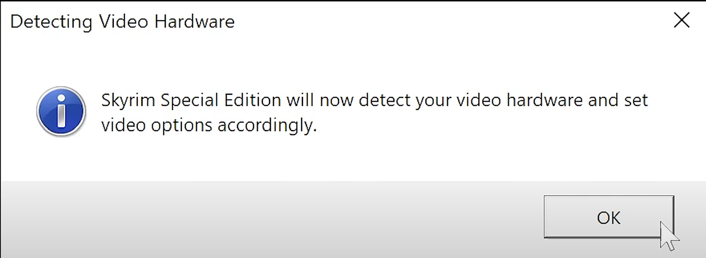

   Click `OK` and then `PLAY` in Skyrim Launcher.

3. **Download AE content.** When you get to the main menu - the game would suggest you to download the AE content - click `DOWNLOAD`:

   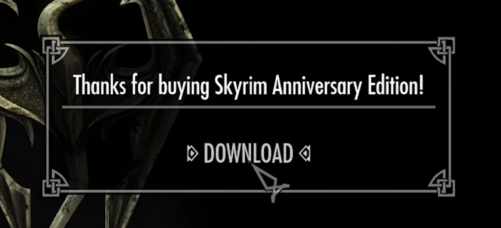
> [!IMPORTANT]  
> DON'T MINIMIZE THE GAME! Wait till everything is downloaded and popups stop appearing.

> [!TIP]
> If you're not sure that everything downloaded properly _(i.e. you accedentally closed the game while AE content was downloading)_ - do this:
>- Close the game and launch Skyrim from Steam again
>- Click `Creations`
>- Click `[O] Options` (at the bottom)
>- Click `Download all owned Creation Club Creations`
### 2. Creating directories and setting AV exceptions

1. **Create a directory for Wabbajack.** Create a directory on the root of one of your Solid State drives (such as `D:\Wabbajack`) where you'd like to install _Wabbajack_ later on.
2. **Create a directory for Licentia NEXT.** Now, do the same for Licentia - i.e. `D:\Licentia NEXT`.

3. **Make AV exceptions.**
> [!WARNING]  
> Ensure you have set antivirus exceptions for:
> - _Licentia_ folder (`D:\Licentia NEXT`)
> - _Skyrim_ vanilla game folder (i.e. `D:\Games\Steam\steamapps\common\Skyrim Special Edition`)
> - _Wabbajack_ folder (i.e. `D:\Wabbajack`)
> 
> Otherwise, the installation will fail. 
> 
> Certain antivirus packages do not properly respect exceptions and cannot be fully disabled (_Webroot_ and _Bitdefender_ are examples of these). These tools **must be uninstalled** from your system.

### 3. Installing and configuring Wabbajack
1. **Get the Wabbajack app.** Download latest `Wabbajack.exe` [here](https://github.com/wabbajack-tools/wabbajack/releases/latest/download/Wabbajack.exe) and save it to Wabbajack folder we created earlier (i.e. `D:\Wabbajack`).
2. **Start the _Wabbajack_ app.** Start the `Wabbajack.exe` we downloaded earlier, Wabbajack would download its assets and _eventually_ open, just wait for a minute. 
3.  **Login to _Nexus_ within the _Wabbajack_ app.** On the main screen click the **GEAR** icon in the top right:

    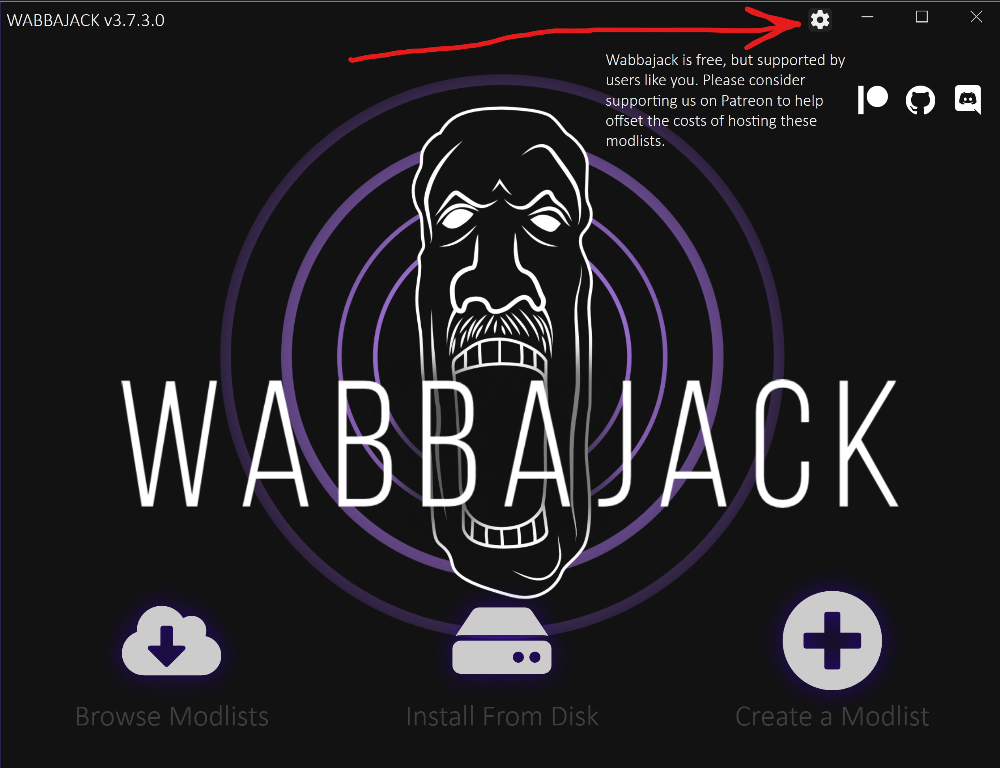

    Here, click `Login` near Nexus logo:

    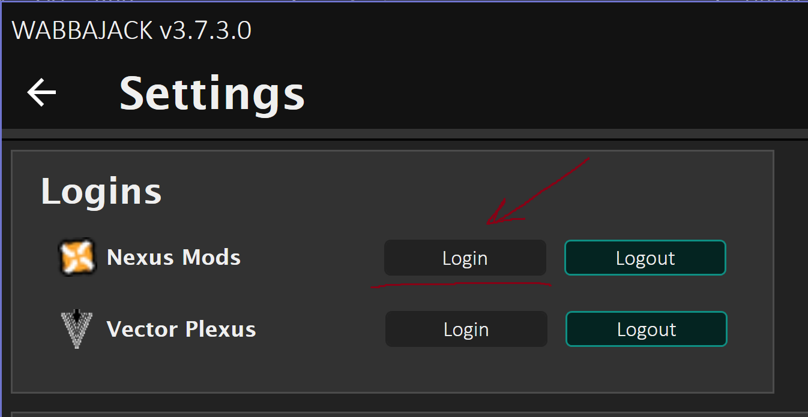

    You'd be directed to Nexus website, login there as usual and click `Allow` when prompted. Login window will close by itself.
    In Wabbajack UI toggle will go over to `Login` when successful.

    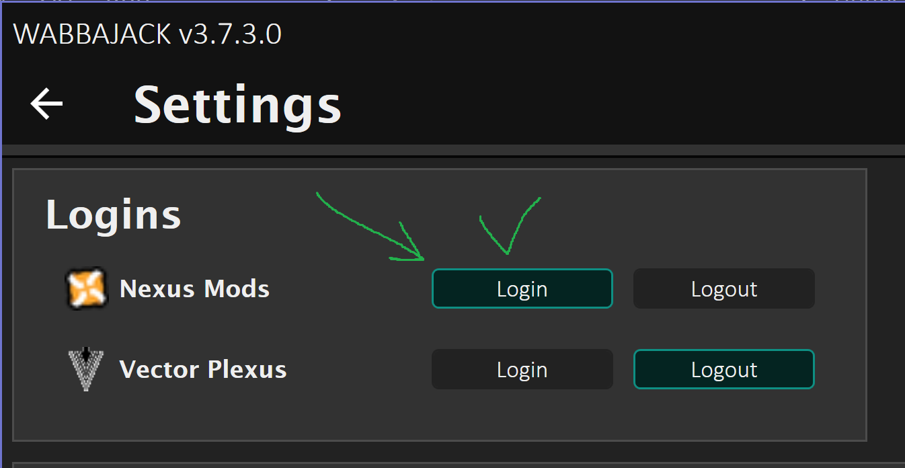

### 4. Downloading and installing the list from Wabbajack
1. Go back from `Settings` to main Wabbajack UI and press `Browse Modlists`:

    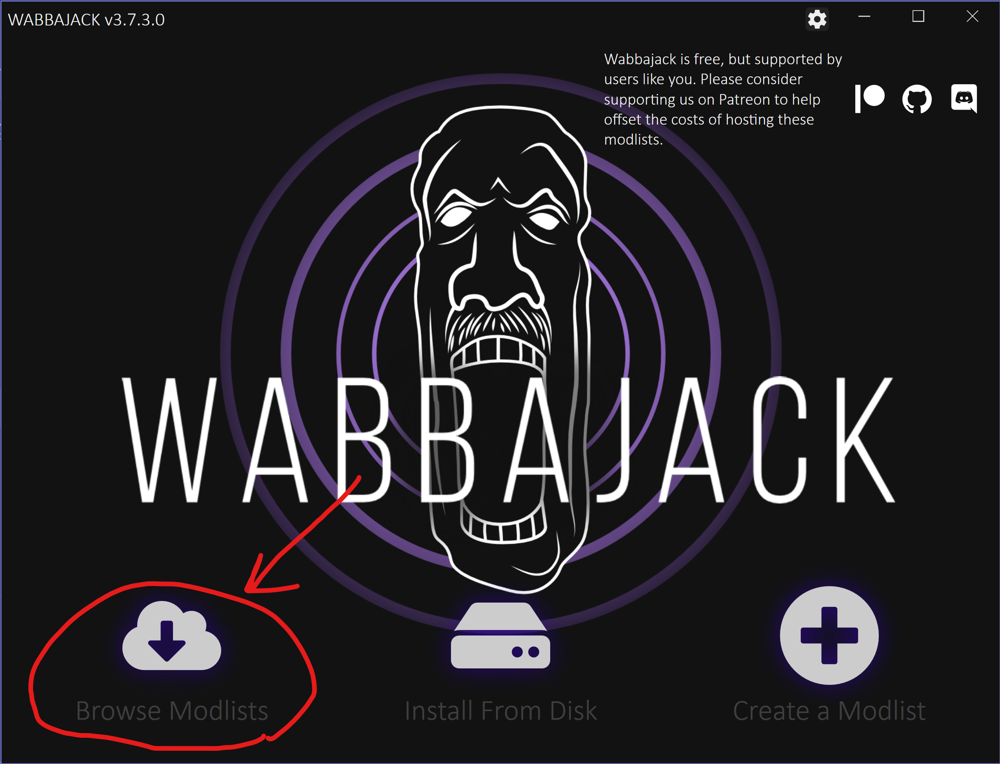

2. Select filters in the top row - `Skyrim Special Edition` as a game **(1)**, tick `Show NSFW` **(2)** and `Show Unofficial Lists` **(3)**. When you see `Licentia NEXT` - click the download icon **(4)**:
   
    
    
    This will download _Licentia's_ **Wabbajack file**, which is basically an installation package.
3. When the download of the file is complete, the icon will change - hit `Play`:

    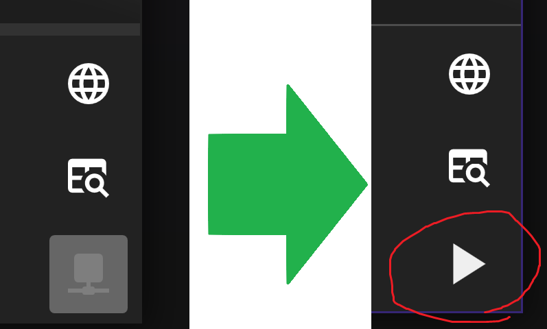
    
4. You'll see this screen. Select the directory we created for Licentia **(1)**, downloads folder would be populated automatically **(2)** _(you can change where downloads would be stored if you want, i.e. on another, slower drive)_, and hit `Play` button **(3)**:

    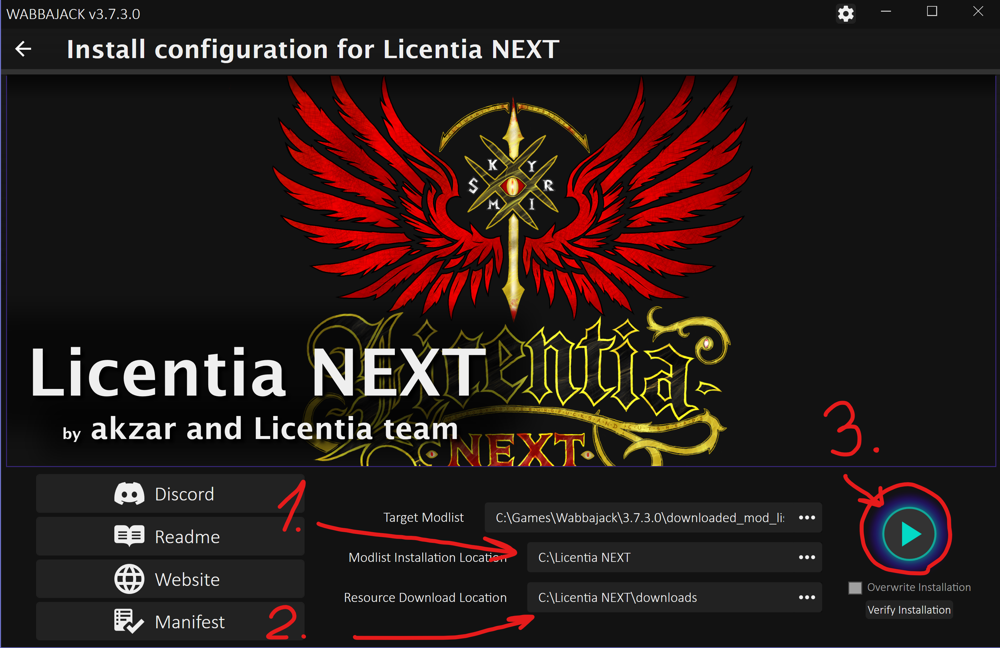

    **This would begin the actual download and installation of the list.**
> [!NOTE]  
> Depending on your system specs, the download and installation process can take a **long time**.

> [!TIP]
> There are many different scenarios where _Wabbajack_ will produce an **error**.
> 
> **General advice** - re-run _Wabbajack_ before seeking assistance. _Wabbajack_ will only download and reinstall the minimum necessary to get the modlist working.
>
> You can find most common issues below.
>---
>| Issue | Solution |
>| :--- | :--- |
>| **Various files beginning with `cc` and ending with `esl` or `esm` failed to download** | You did not purchase the [$20 upgrade to Skyrim](https://store.steampowered.com/app/1746860/The_Elder_Scrolls_V_Skyrim_Anniversary_Upgrade/), and this is not negotiable. Purchase it, verify it, delete it and re-download it if necessary, and try again. | 
>| **Could not download X** | Some Internet providers have difficulty accessing the servers hosting the list's files. Use a VPN (Virtual Private Network) with a terminus set to the United States. Free options include _ProtonVPN_ and _Cloudflare WARP._ If a download gets interrupted, delete all corrupt local copies before trying again. |
>| **Wabbajack could not find my game folder** | _Licentia NEXT_ will not work with a GOG or pirated game version. If you own the game on _Steam,_ return to the Installation step. If this still doesn't work, ensure you are not running Wabbajack as an Administrator. **Asking for help with pirated copies of the game will get you banned from Discord Support.** |

---

5. If you see this in the bottom right part of Wabbajack - that means your **installation is complete!**

    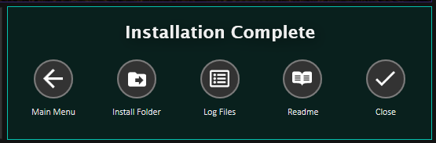

    You can close Wabbajack now.

## :three: Post-Installation

### 1. Verifying the Modlist

> [!CAUTION]
> **DO NOT OPEN MOD ORGANIZER 2 AFTER INSTALLATION UNLESS TOLD TO DO SO.**
> 
> This will cause the Verification to fail.

_Licentia NEXT_ is over **HALF A TERABYTE** in size with almost **HALF A MILLION** individual files. Given the likelihood of corrupted files during installation, it is strongly recommended that files be checked after installation.

1. Start _Wabbajack_ app again after installation.

2. Click `Browse Modlists` again, find Licentia NEXT and hit `Play` icon again (as we did above).

3. Ensure that all the same settings are used as during the installation process. You need the **SAME** `.Wabbajack` file and the **SAME** Modlist and Downloads folders. Click the **VERIFY** button in the Lower Right Corner of _Wabbajack_:

    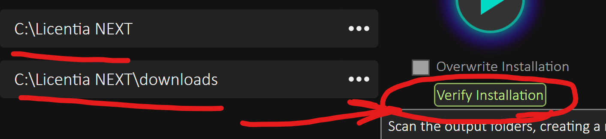

4. Wait for the process to complete. It can take quite some time.

> [!IMPORTANT]
> You **MUST** receive a popup webpage that is **BLANK** with **ZERO ERRORS** or you will have horribly weird bugs and crashes that are impossible to troubleshoot.

5. If you received **ANY** errors you **MUST** reinstall the list with the `Overwrite` checkbox selected. Do not worry, it will not redo everything. _Wabbajack_ can scan itself to see what's wrong and repair only what needs to be repaired.

### 2. Starting Mod Organizer and launching Licentia NEXT

1. Navigate to your Licentia NEXT directory and **execute ModOrganizer.exe**:

    

2. If prompted, choose `Yes` to associate Mod Organizer with `.nxm` links. If there’s no prompt, **skip this step**.
3. In the top-right corner, make sure that `SKSE` is selected from the dropdown **(1)**, and click the Run button **(2)**:

    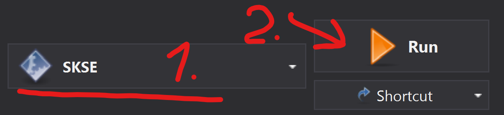

> [!TIP]  
> Wabbajack auto-detects and sets your **game resolution**, but if you wish to change your game's resolution **manually**, select the `INI Editor` from the `Tools` menu along the icon bar of MO2:
> 
>    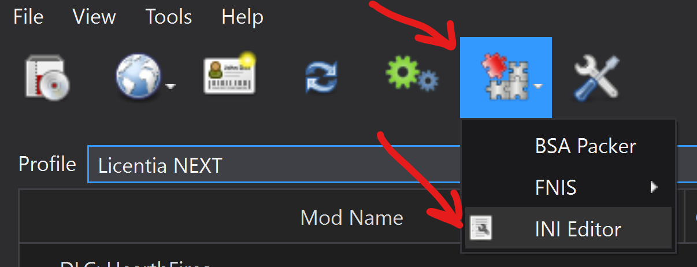
> 
> Select `SkyrimPrefs.ini` file. Scroll down until you see the `[Display]` header and look for the `iSize` values. Note that the TYPICAL ORDER IS REVERSED, the HEIGHT is listed BEFORE the WIDTH:
> 
>    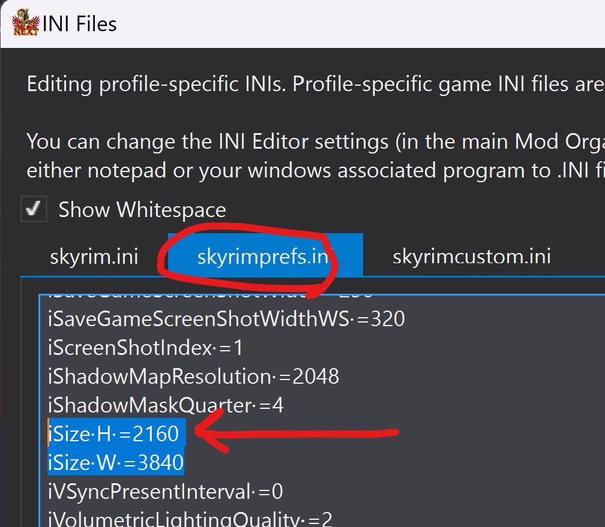
> 
> Hit `Save` at the bottom, and you're done!

4. Wait untill the game loads, **it might take a while!** 
> [!NOTE]  
> There's a game of `Flappy Dragon` that opens up while your Skyrim is loading:
> 
>    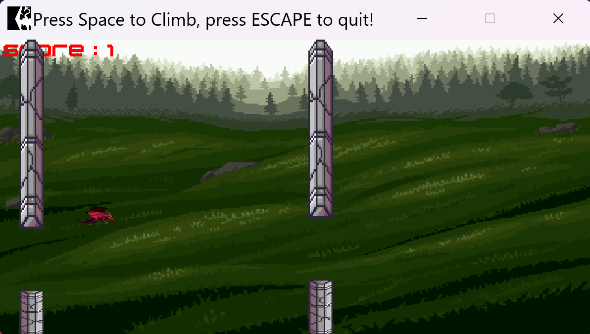
> 
> Don't worry, _you didn't just download 500 GB of Flappy Dragon_!
> It's there just to brighten up the waiting time :dragon_face:

**When you're in the main Skyrim menu** &mdash; proceed to the next step.

### 3. Starting a save and configuring MCMs for the Modlist in-game

1. **Start the game** &mdash; in main menu as normal by pressing `New Game`
2. **Create & Name Your Character** &mdash; choose your character’s appearance and name.
3. **Wait for Mod Initialization**
> [!CAUTION]
> WHEN YOU SPAWN IN, **DO NOT TOUCH ANYTHING!**
> As much as possible, try to remain still in game and not open menus while the MCM setup is in progress.
>
> After gaining control of your character, wait. Mods will initialize &mdash; **wait for all of the messages in the upper left corner of the screen to appear and disappear**. A warning will be issued that this readme is mandatory for proper installation. Click through and continue to wait untill you get this pop-up saying `Museum List Building Complete`:
>
> 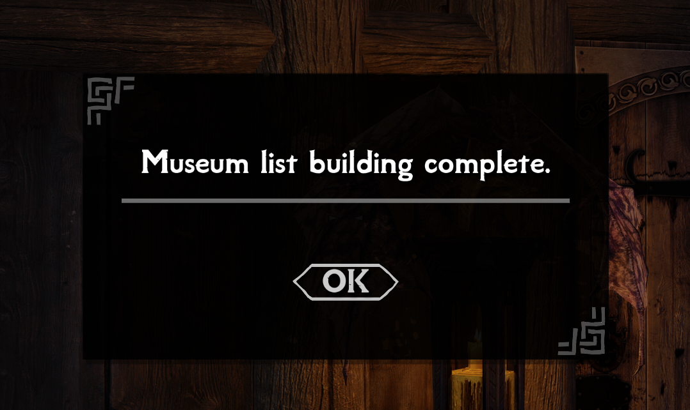
>
> Click `OK` and proceed to next step.

4. **Play MCM Recording.** When all of the messages have disappeared:
   - Open the Main Menu with the `ESC` key and find the entry labeled `"MCM Recorder"` (They are in alphabetical order.) 
   - Here, you will find an recording labeled `Licentia NEXT main recording`.
   - Click on it, answer `Yes`, and use `ESC` to back out of all menus. 
   - You will receive a popup asking if you wish to play the recording &mdash; please do so.
   - Once again, please wait for all of the messages in the upper left corner of the screen to appear and disappear.

5. Save your game, exit the game **COMPLETELY TO THE DESKTOP**, start it again via MO2 as described above, and load that save.
6. That's it! Your modlist is configured :birthday:

## :hearts: Final Notes

- When you reach your first exterior world location, you will be prompted to enable Survival Mode. This mod disables fast travel and requires eating, sleeping, and staying warm to survive. The option can be changed later in the default `Gameplay` settings of Skyrim.

- You will also receive a prompt about which Divine and/or Daedra you wish to worship, depending on your race. Choose according to your preference.

- **Controls map** with nice graphics can be viewed by pressing `F11` in-game (thanks to @CatastrophicApathy)

## :wrench: Troubleshooting

Refer to [Troubleshooting](TROUBLESHOOTING.md) for answers to common problems with the modlist.

## :repeat_one: Updating the Modlist

Download the modlist's `.wabbajack` file again and specify the same directories. _Wabbajack_ will only update what has changed, it will not repeat the entire installation. It is rarely recommended to continue a save when you update a modlist (unless an update is labeled `Save Safe` in the changelog/announcement)

## :skull: Removing the Modlist

You can just remove your _Licentia's_ **install folder**.

## :mailbox_with_mail: Contact

You can contact me (akzar) or anyone from the Licentia Team on [Vermi's Hub discord server](https://discord.gg/hRCYPMpX7J). Don't forget to grab `Licentia` role, we'd be glad to help you :wave: