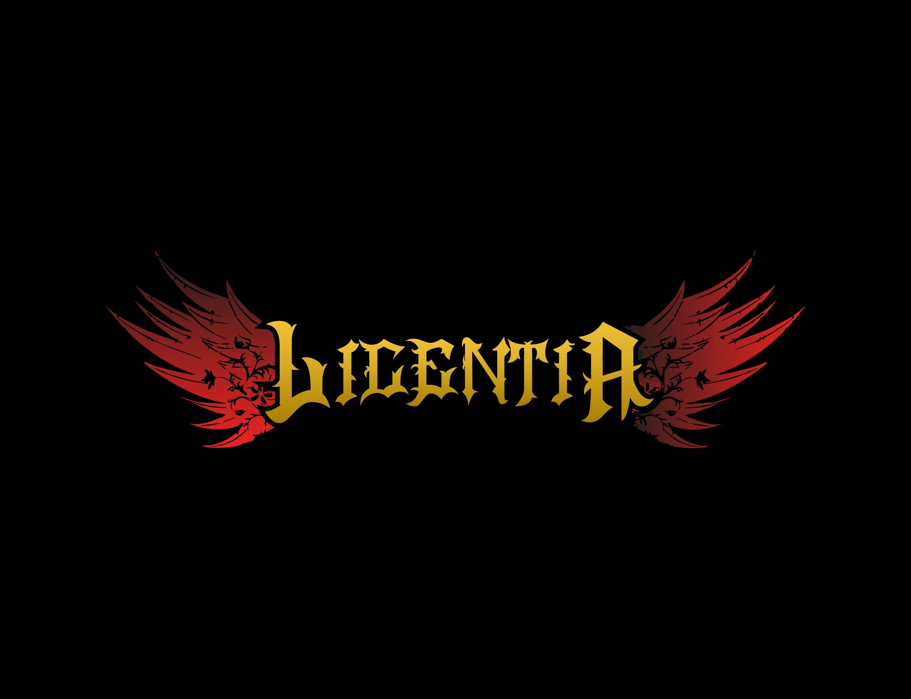

# LICENTIA BLACK

## "All I want to be is a badass comic book hottie who fucks and cuts heads."

### Interested in other NSFW lists? Join my Discord Server!

You can find the link to my Discord server at the end of this document.

## Preamble

**This Modlist contains mods with sexual content and you need to be of legal age in your country (most western countries: 18+, some eastern ones: 21+)**.

_Licentia BLACK_ is one of _Wabbajack's_ oldest and most well-regarded adult modlists, featuring optional non-fetish content with the _OSuite_ series of _OSA / OStim_ mods and an emphasis on build variety, backed up by an accessible Power Fantasy design philosophy. It also includes a host of displayable collectibles in the form of the _Legacy of the Dragonborn_ museum, with patches to incorporate **every** LOTD Quest Mod and all but one of the "Super Follower" mods. In addition to all this, the author places great weight on ensuring the list is as stable as it can possibly be and aggressively removes mods which cause regular crashes, and recent improvements to the NSFW framework ensure that it is much more viable for a long-term playthrough. As the final bonus, additions and customizations are welcomed via the author's Discord server, so if you don't like the list, **MAKE IT YOUR OWN!!**

## Requirements

- [Nexus Premium Account](https://forums.nexusmods.com/index.php?/store/category/1-premium-membership/)
- [LoversLab Account](https://www.loverslab.com/)

## Installation

###  Installing Microsoft Visual C++ Redistributable Package

The _Microsoft Visual C++_ redistributable package is required for _Mod Organizer 2_ and you can download it from _Microsoft._ Download the x64 version under "Visual Studio 2015, 2017 and 2019" [here](https://aka.ms/vs/16/release/vc_redist.x64.exe).

###  Steam Config

**Change Steam's Update Behavior**

To ensure that _Steam_ does not automatically update _Skyrim_ for you and lock you out of playing your _Wabbajack_ modlist(s), open the Properties window of _Skyrim AE_ in _Steam_, navigate to the Updates tab and change Automatic updates to _Only update this game when I launch it_. You should also disable the _Steam Cloud_. It is incompatible with the profile-specific saves of a _Wabbajack_ modlist.

**Set the Game language to English**

_Wabbajack_ will check your game files and make sure that your installed version is the same as my installed version. This also means that any other language than English will fail the installation. You can change the game's language in the Properties window as mentioned above. It may be required to verify your files afterward.

**Install Skyrim** 

The _Anniversary Edition_ upgrade is required. No exceptions will be made. If you do not have the game installed, do so and launch the vanilla game to download all _Creation Club_ content available with the upgrade. If for some reason you have problems with your _Steam_ installation, you may need to verify the local content as described in _Steam's_ documentation.

**Do Not Use Any Part of This List in a Protected Folder**

This includes `Program Files,` `Program Files (x86)`, `Downloads`, `Documents`, the `Desktop` or any other folders that _Windows_ considers "Protected" (essential to the operating system). If the _Wabbajack_ folder, the _Skyrim Special Edition_ folder, the _Steam_ folder, the modlist folder or the downloads folder are in any of these directories, the modlist will not function properly. Relocate offending folders to a non-Protected location such as the root directory of one of your drives. (D:\ for example.)

**Do Not Use Any Protected Folders inside of OneDrive**

You will experience unusual behavior if your `My Games` folder (usually in the `Documents` folder) is part of a _OneDrive_ Cloud Folder. You will need to relocate it or disable _OneDrive._ There are no exceptions.

**Make Exceptions for Anti-Malware Programs**

Exclude antivirus and anti-malware programs from monitoring three directories: those containing the _Wabbajack_ app, the _Skyrim Special Edition_ game folder, and the directory in which you wish to install the modlist. _Wabbajack_ and _Mod Organizer 2_ both use low-level file system virtualization which most anti-malware programs falsely detect as malicious. 

Particularly intrusive malware solutions such as _Bitdefender_ and _Webroot_ don't propery respect exclusions and cannot be completely disabled -- they must be fully uninstalled. Please consider avoiding third-party anti-malware solutions and relying on _Windows Defender,_ which is more compatible with the applications used to install and play _Wabbajack_ modlists. 

**Set Pagefile to 40GB Or Above**

This can be accomplished in the System Settings for Windows. It is recommended to set the minimum and maximum pagefile size to `40,960` all on one solid state drive as mentioned above. More than one pagefile is not needed so long as it is large enough and located on a fast enough drive.

**Ensure Enough Free Storage Space**

As of this writing approximately **20GB** is required for the `Steam` folder, **170 GB** for the downloads folder, and **260 GB** for the modlist folder. Approximately **30 GB** of free space is required on your `Windows` drive and **30 GB** additional free space on your `Wabbajack` drive to leave room for temporary files, patches, and caches. Thus the total required space is approximately **510 GB.** These do not all need to be on the same drive.  Finally, never reduce the free space on any drive below **15%** (the bar in _File Manager_ will turn red) or you will suffer severe performance problems.
 
##  Using Wabbajack

The download and installation process can take a very long time depending on your system specs. 

It is advised to have ALL relevant folders (for `Wabbajack.exe`, `Steam`, the modlist folder, and the downloads folder) on a solid state drive. Do not place any of these folders on a hard disk drive, flash drive, or external drive of any kind. After the list is installed, you can relocate **only** the downloads folder to such a drive (or delete it, but that may make updating difficult).

##  Problems with Wabbajack

There are a lot of different scenarios where _Wabbajack_ will produce an error. Re-run _Wabbajack_ before seeking assistance. _Wabbajack_ will only download and reinstall the bare minimum necessary to get the modlist working. 

**DO NOT CONTACT MOD AUTHORS DIRECTLY.**

I, cacophony, fully accept any responsibility for difficulties with this list and any conflicts I introduce, so please do not question mod authors on the _Nexus_, _Lover's Lab_, _Vector Plexus_ or any other site about bugs that may result from this lists' use. Direct your questions to me, not the innocent mod authors who should never be expected to support a modlist setup.

**Various files beginning with "cc" and ending with "esl" or "esm" failed to download.**

You did not purchase the $20 upgrade to Skyrim. This is not negotiable. Purchase it, verify it, delete it and re-download it if necessary, and try again.

**Could not download x:**

Some Internet providers have difficulty accessing the servers which host the files comprising the list. Try using a VPN (Virtual Private Network) with a terminus set to the United States. Free options include _ProtonVPN_ and _Cloudflare WARP._ If a download gets interrupted, you may need to delete all corrupt local copies before trying again.

**Wabbajack could not find my game folder:**

_Licentia Black_ will not work with a GOG or pirated version of the game. If you own the game on _Steam,_ go back to the Installation step. If this still doesn't work, ensure that you are not running Wabbajack as an Administrator. **DO NOT ASK FOR HELP WITH PIRATED GAMES.**

**MEGA download cap exceeded.**

This shouldn't happen unless you download the list multiple times or download multiple _Wabbajack_ lists. I can't support circumventing MEGA's bandwith restrictions so either sign up for an account or wait for the timeout to expire.

## Post-Installation

### System Specifications

The list's performance requirements have been greatly increased, therefore, the recommended setup for an enjoyable experience is at least

- intel i7 or AMD Ryzen 5600 or later
- NVIDIA RTX 2070 SUPER or AMD Radeon 5700 XT or later

The list is configured for a resolution of `1920x1080` by default, to reduce support questions because the list cannot automatically downscale. It _will_ automatically upscale to higher resolutions at a sacrifice in quality. If you wish to increase your resolution for **BEST** quality, select the "INI Editor" from the _Tools_ menu along the icon bar of MO2 and change it via the `SkyrimPrefs.ini` file. Scroll down until you see the `[Display]` header and look for the `iSize` values. Note that the TYPICAL ORDER IS REVERSED, so for 1440p you would set the first value, `iSize H=` to **1440** and the second value, `iSize W=` to **2560.**

If you are confident you meet the above target, but still experience severe performance drops, you may need to customize your `BIOS` settings to maximize your hardware. Refer to your motherboard's documentation.

### Launching the List

Launch _Licentia Black.exe_ (a renamed copy of _Mod Organizer 2_ with a custom icon) from the directory in which you installed the list. Launch the game from the **SKSE** entry in the drop-down menu.

## MCM CONFIGURATION

## WHEN YOU SPAWN IN HELGEN'S INN, DO NOT TOUCH ANYTHING!

Wait until all the messages appear then disappear in the upper left corner of the screen. Then you may continue.

## MCM Recorder

Find the _MCM Recorder_ menu in the _Mod Configuration_ menu accessible via the `ESCAPE` key or the `START` button. Click the "RUN ME" recording, click OK, close the MCM menu, click the "Run Recording" button when it appears, and **TOUCH NOTHING.** Wait for a message to pop up saying playback is finished, then wait for all messages to disappear in the upper-left corner of your screen. There may occasionally be error messages referencing outdated settings. They are unimportant. Skip them.

Everything should now be configured automatically thanks to **NEW** MCM Recordings. Enjoy the modlist!

## FINAL NOTES

When you reach your first exterior world location, you will be prompted to enable _Survival Mode_. With this option enabled, you will not be able to fast travel normally, markers can be placed next to other markers, and you will have to eat food, sleep, and stay warm to survive. (Fast travel can, however, be enabled on _Survival Mode_ by consulting the _Conner's Survival Mode_ MCM.) You will also receive a prompt about which Divine and/or Daedra you wish to worship, depending on your race. Choose according to your preference.

## Updating the Modlist

Many times newer versions of _Licentia_ will require an updated version of _Wabbajack_. Please ensure that you run _only_ the `Wabbajack.exe` located in the root of the _Wabbajack_ directory. _Wabbajack_ will automatically update to the latest version if necessary. 

Download the modlist from the Gallery and specify the same directories. Then check the "Overwrite" box. Never update a list without checking this box. If you have customized the list, you can append `[NoDelete]` to the beginning of your added mods in _Mod Organizer 2_ and they will not be deleted. However, they will be unchecked and relocated to the bottom of the list of installed mods. You will need to return them to their rightful place and re-enable or rewrite any patches you created.

It is rarely recommended to continue a save when you update a modlist.

## Removing the Modlist

You can just remove the _Licentia BLACK_ folder. 

# IF YOU ENCOUNTER INSTALL PROBLEMS, ERROR MESSAGES, CRASHES, OR OTHER UNEXPECTED BEHAVIOR

Refer to [Troubleshooting](TROUBLESHOOTING.md). If you can't find your answer there, ensure that you have followed **EVERY STEP** of this readme to the letter. Often a reinstall of the list will solve many unusual problems. If your problem involves an inability to continue a mandatory portion of the game, refer to the _Unofficial Elder Scrolls Pages_ and verify that you are not experiencing a vanilla bug. Try loading a save from before the most recent quest stage or dungeon that you started. 

## Guides for modifying the list are available! I will not discipline you for modifications!

- To enable controller support for _Licentia,_ [consult the controller guide available here](controller-guide.md).
- To use _Skyrim Outfit System_ (the transmog mod) properly, [consult the guide for it here](SoS-OutfitSystem-Guide.md).
- To add some cool, nifty new animations to your copy of _Licentia_, [be sure to run Nemesis afterward](How-To-Run-Nemesis.md).
- To add your dream outfits to your copy of _Licentia,_ [consult the BodySlide document available here](How-To-Add-Outfits.md).
- If you add any mod to the list, you need to [run Synthesis as described here](How-To-Run-Synthesis.md).

For help with your additions, stop by my #black-additions channel and you might just get it!

## Contact

I am regularly available on [my discord server](https://discord.gg/jolly-coop).

If you enjoyed playing this modlist and feel that your time spent with it was worth any amount of money, consider giving me a tip. There are donation options ranging from $1 to $35 (with a merch bonus) to extravagant gifts from an Amazon wishlist. Consult my webpage at [cacophony.me](https://cacophony.me) for details (at the bottom of the page).

## Contributing

See [Contributing](CONTRIBUTING.md).

## Changelog

See [Changelog](CHANGELOG.md).
